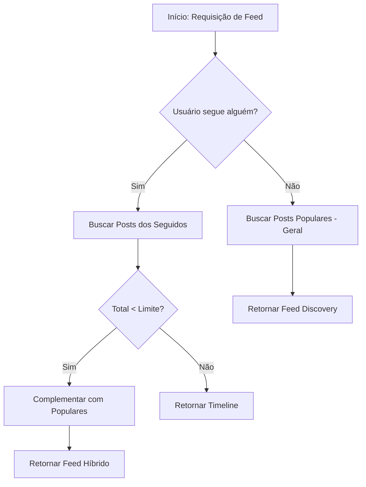

# Documentação Técnica: Algoritmo de Feed Híbrido e Grafo Social (IF REDE)

## 1. Descrição do Módulo
Este módulo gerencia as conexões entre acadêmicos e a entrega inteligente de conteúdo. O objetivo é garantir que o usuário sempre tenha conteúdo relevante em sua página principal, priorizando suas conexões diretas e oferecendo descobertas baseadas em popularidade.

## 2. Grafo Social (Seguidores)
A modelagem utiliza uma coleção dedicada `seguidores` que mapeia relações bidirecionais.
- **Normalização:** Armazenamos referências de `seguidor_id` e `seguido_id`.
- **Escalabilidade:** Índices compostos garantem que a verificação de "quem eu sigo" e "quem me segue" ocorra em tempo constante ($O(1)$) para o banco de dados.

## 3. Algoritmo de Feed Híbrido (Cascata)
O feed não é uma simples consulta cronológica. Ele segue um algoritmo de duas fases:

1.  **Fase de Timeline:** O sistema identifica os usuários que o acadêmico segue e busca postagens recentes desses perfis que respeitem as regras de visibilidade (público ou seguidores).
2.  **Fase de Descoberta (Fallback):** Caso a Timeline não preencha o limite da página (ex: usuário novo que segue poucas pessoas), o motor de busca executa uma consulta de "Popularidade". Postagens com maior número de curtidas e visualizações são injetadas no feed, promovendo a descoberta de novos talentos acadêmicos.

## 4. Justificativa Técnica
A implementação evita o "vazio de feed", um problema comum em redes sociais novas. Ao utilizar o padrão de **Hybrid Discovery Feed**, garantimos o engajamento imediato. A ordenação utiliza índices de popularidade compostos no MongoDB, garantindo performance mesmo com alto volume de dados.

## 5. Diagrama de Fluxo do Feed (Discovery)

