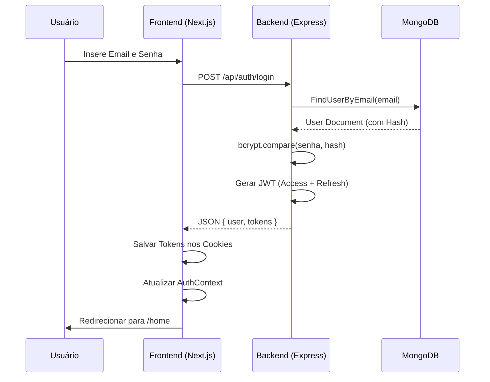

# Documentação Técnica: Sistema de Autenticação JWT (IF REDE)

## 1. Descrição do Módulo
O módulo de Autenticação do IF REDE gerencia a entrada segura de acadêmicos e servidores na plataforma. Utilizando o padrão de Tokens de Acesso (JWT), o sistema garante que a identidade do usuário seja preservada de forma stateless entre o frontend (Next.js) e o backend (Express).

## 2. Fluxo de Dados e Segurança
A implementação segue o rigor técnico exigido para aplicações modernas:
1. **Sanitização:** Os dados de entrada (Email/Senha) são limpos e normalizados antes de atingir o banco de dados.
2. **Criptografia:** Senhas nunca são armazenadas em texto plano. Utilizamos o algoritmo **bcrypt** com fator de custo 10 para gerar hashes irreversíveis.
3. **Persistência Stateless:** Após a validação, o servidor emite um par de tokens. O *AccessToken* (15m) autoriza requisições imediatas, enquanto o *RefreshToken* (7d) permite a renovação da sessão sem nova inserção de senha.
4. **Middleware SSR:** O Next.js utiliza um middleware de borda para ler os cookies de autenticação, impedindo que usuários não autorizados acessem páginas protegidas como `/home` e `/profile`.

## 3. Justificativa Técnica
A escolha do JWT (JSON Web Token) justifica-se pela escalabilidade horizontal. Ao não armazenar sessões em memória no servidor, permitimos que a aplicação cresça sem gargalos de sincronização de estado. A separação entre perfil e configurações no schema do MongoDB (Mongoose) otimiza as consultas de login, carregando apenas o necessário para a geração do token.

## 4. Diagrama UML de Autenticação

