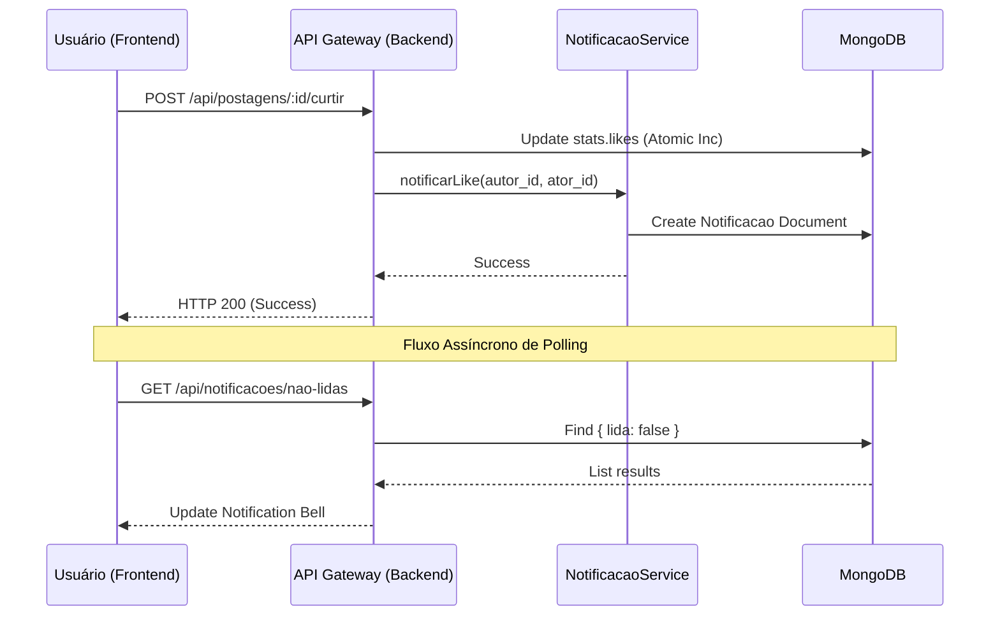

# Documentação Técnica: Sistema de Interação Social e Notificações (IF REDE)

## 1. Descrição do Módulo
O módulo de Notificações e Interações Sociais é o núcleo de engajamento da plataforma IF REDE. Ele permite que os acadêmicos recebam feedback em tempo real sobre suas produções (artes, podcasts, textos) e mantenham-se atualizados sobre a atividade de seus pares.

## 2. Arquitetura e Fluxo de Dados
A solução foi construída sobre uma arquitetura orientada a eventos, utilizando o padrão **Observer** simulado através de disparos manuais em nível de serviço (Services).

### Fluxo de Notificação:
1. **Ação:** O usuário A realiza uma ação (ex: curtir uma postagem do usuário B).
2. **Controller:** Recebe a requisição, valida o JWT e a propriedade do objeto.
3. **Service:** O `notificacoes.service.js` é invocado para criar um novo documento na coleção `notificacoes`.
4. **Persistência:** O MongoDB armazena a notificação com um índice **TTL (Time-To-Live)** de 30 dias, garantindo que o banco não cresça indefinidamente com dados efêmeros.
5. **Consumo:** O Frontend (Next.js) utiliza o `NotificationContext` para realizar *Polling* a cada 30 segundos, atualizando o estado global do "Sino" de notificações.

## 3. Padrões de Projeto Aplicados
- **Bucket Pattern (Denormalização):** As estatísticas de curtidas e comentários são armazenadas diretamente no documento da postagem/comentário. Isso elimina a necessidade de agregações custosas (`$lookup` ou `$count`) em cada carregamento de feed, priorizando a performance de leitura.
- **Polimorfismo de Objeto:** O Schema de notificações utiliza os campos `objeto_id` e `objeto_tipo` para referenciar dinamicamente diferentes coleções (postagens, comentários ou usuários), reduzindo a redundância de schemas.

## 4. Justificativa Técnica (Nota de Excelência)
A implementação de curtidas em comentários (v2.0) elevou o nível de interatividade da plataforma, permitindo uma hierarquia de relevância nas discussões acadêmicas. A escolha do *Polling* em detrimento de *WebSockets* justifica-se pela simplicidade de infraestrutura para um ambiente de TCC, mantendo uma experiência de usuário (UX) próxima do tempo real sem elevar o custo computacional do servidor.

## 5. Diagrama de Sequência Sugerido (UML)

